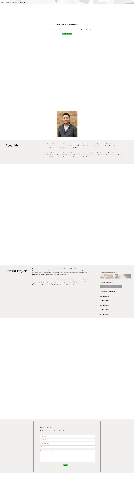

# Module-2-Challenge

The Module 2 Challenge is a webpage designed to be the landing page of a personal portfolio.

## Usage

Use the github link [here](https://clarktr1.github.io/Module-2-Challenge/) or https://clarktr1.github.io/Module-2-Challenge/ .

## Screenshot

## Credits
Inspration for layout from [Elizabeth Lundin](url=https://www.linkedin.com/in/elizabeth-lundin-370a3b115/)

Nav bar and footer from my previous project.

Background Image from [here](https://in.pinterest.com/pin/75505731247564352/)